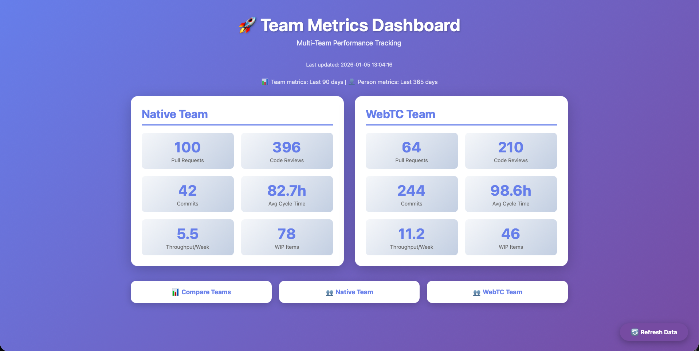

# Team Metrics Dashboard

A Python-based metrics collection and visualization tool for tracking team performance across GitHub and Jira using **GraphQL API** for efficient data collection.



*Multi-team dashboard showing GitHub metrics, Jira throughput, and team comparisons*

## Features

- **GitHub Metrics Collection (GraphQL API)**:
  - Pull Request metrics (cycle time, review time, merge rate)
  - Code review metrics (engagement, response times, cross-team reviews)
  - Contributor activity tracking (commits, lines changed)
  - PR size distribution and trends

- **Jira Integration (Self-Hosted)**:
  - Team-specific Jira filter metrics
  - Throughput tracking (completed items per week)
  - WIP statistics and age distribution
  - Bug tracking (created vs resolved)
  - Flagged/blocked item monitoring
  - Bearer token authentication support
  - SSL verification bypass for self-signed certificates

- **Team-Based Organization**:
  - Multiple team support with separate configurations
  - Team-level metrics and dashboards
  - Person-level metrics for individual contributors
  - Team comparison views

- **Web Dashboard**: Interactive Flask-based visualization
  - Main overview dashboard
  - Individual team dashboards
  - Person dashboards (contributor-level metrics)
  - Team comparison dashboard

- **Efficient Data Collection**:
  - GraphQL API for GitHub (50-70% fewer API calls vs REST)
  - Separate rate limits from REST API (5000 points/hour)
  - Offline collection with caching (`collect_data.py`)
  - Dashboard refresh button using GraphQL

## Project Structure

```
team_metrics/
├── src/
│   ├── collectors/
│   │   ├── github_graphql_collector.py  # GraphQL API collector
│   │   ├── github_collector.py          # Legacy REST API collector
│   │   └── jira_collector.py            # Jira REST API + Bearer auth
│   ├── models/
│   │   └── metrics.py                   # Metrics calculation
│   ├── dashboard/
│   │   ├── app.py                       # Flask app with routes
│   │   └── templates/                   # Dashboard HTML templates
│   └── utils/                           # Utility functions
├── data/
│   └── metrics_cache.pkl                # Cached metrics data
├── config/
│   ├── config.yaml                      # Your configuration (gitignored)
│   └── config.example.yaml              # Template configuration
├── collect_data.py                      # Offline data collection script
├── list_jira_filters.py                 # Utility to find Jira filter IDs
└── requirements.txt                     # Python dependencies
```

## Setup

### 1. Install Dependencies

```bash
python3 -m venv venv
source venv/bin/activate
pip install -r requirements.txt
```

### 2. Configure GitHub and Jira Access

Copy the example configuration:
```bash
cp config/config.example.yaml config/config.yaml
```

Edit `config/config.yaml` and add:

**GitHub Configuration:**
```yaml
github:
  token: "your_github_personal_access_token"
  organization: "your-org-name"
  days_back: 90
```

**Jira Configuration** (for self-hosted Jira):
```yaml
jira:
  server: "https://jira.yourcompany.com"
  username: "your_jira_username"  # NOT email - use username
  api_token: "your_bearer_token"  # Bearer token for authentication
  project_keys:
    - "PROJECT1"
    - "PROJECT2"
```

**Team Configuration:**
```yaml
teams:
  - name: "Backend"
    display_name: "Backend Team"
    github:
      team_slug: "backend-team"
      members:
        - "github-user1"
        - "github-user2"
    jira:
      members:
        - "jira-user1"
        - "jira-user2"
      filters:
        backlog_in_progress: 12345
        bugs: 12346
        completed_12weeks: 12347
        # ... more filter IDs
```

### 3. Find Your Jira Filter IDs

Run the utility script to discover your Jira filter IDs:
```bash
python list_jira_filters.py
```

Add the relevant filter IDs to your team configuration.

### 4. Collect Data

Run the data collection script (takes 15-30 minutes):
```bash
source venv/bin/activate
python collect_data.py
```

This collects GitHub and Jira metrics and saves them to `data/metrics_cache.pkl`.

### 5. Start the Dashboard

```bash
python -m src.dashboard.app
```

Access the dashboard at:
- Main: `http://localhost:5000`
- Team view: `http://localhost:5000/team/<team_name>`
- Person view: `http://localhost:5000/person/<username>`
- Comparison: `http://localhost:5000/comparison`

## Configuration

### GitHub Token Permissions

Create a GitHub Personal Access Token with these permissions:
- `repo` - Access to repositories (required for PRs, commits)
- `read:org` - Read organization data (required for team membership)

### Jira Bearer Token

For self-hosted Jira instances:
1. Generate a personal access token in Jira
2. Use **Bearer token authentication** (not username/password)
3. Configure with `username` field (not `email`)
4. SSL verification is automatically disabled for self-signed certificates

Test your Jira token:
```bash
curl -H "Authorization: Bearer YOUR_TOKEN" -k https://jira.yourcompany.com/rest/api/2/serverInfo
```

### Team Configuration

Each team requires:
- **name**: Internal team identifier (used in URLs)
- **display_name**: Human-readable team name
- **github.team_slug**: GitHub team slug
- **github.members**: List of GitHub usernames
- **jira.members**: List of Jira usernames (may differ from GitHub)
- **jira.filters**: Dictionary of filter IDs for team-specific metrics

**Filter Types:**
- `backlog_in_progress`: Items in backlog or in progress
- `bugs`: Current bug count
- `bugs_created`: Bugs created in time period
- `bugs_resolved`: Bugs resolved in time period
- `completed_12weeks`: Items completed in last 12 weeks
- `flagged_blocked`: Items with impediments
- `recently_released`: Recently deployed items
- `scope`: Team backlog size
- `wip`: Work in progress

## Data Refresh

Three ways to refresh metrics:

### 1. Offline Collection (Recommended)
```bash
python collect_data.py
```
- Full team and person-level metrics
- Takes 15-30 minutes
- Uses efficient GraphQL API

### 2. Dashboard Refresh Button
- Click "Refresh Data" in the web UI
- Team-level metrics only
- Takes 5-10 minutes
- Uses GraphQL API

### 3. Auto-Refresh
- Automatic after 60 minutes (configurable)
- Same as Dashboard Refresh Button

## GraphQL API Benefits

The system uses GitHub's GraphQL API v4 for data collection:

**Advantages:**
- **Separate rate limit**: 5000 points/hour (independent from REST's 5000 requests/hour)
- **Efficient queries**: Fetch PRs, reviews, and commits in single requests
- **Fewer API calls**: 50-70% reduction compared to REST API
- **Better performance**: Faster data collection with pagination built-in

**Implementation:**
- `GitHubGraphQLCollector` in `src/collectors/github_graphql_collector.py`
- Used by both `collect_data.py` and dashboard refresh

## Architecture Highlights

### Multi-Team Support
- Each team has separate GitHub and Jira member lists
- Team-specific Jira filters for custom metrics
- Cross-team comparison capabilities

### Caching Strategy
- Offline collection saves to `data/metrics_cache.pkl`
- Dashboard loads instantly from cache
- Configurable cache duration (default: 60 minutes)
- Refresh on-demand via button or auto-refresh

### Dashboard Views
1. **Main Dashboard** - Overview of all teams
2. **Team Dashboard** - Team-specific metrics with Jira filters
3. **Person Dashboard** - Individual contributor metrics
4. **Comparison Dashboard** - Side-by-side team comparison

## Troubleshooting

### GitHub Rate Limits
If you hit rate limits with GraphQL:
```bash
curl -H "Authorization: Bearer YOUR_TOKEN" https://api.github.com/rate_limit
```

GraphQL has a separate limit, so this is rare.

### Jira Authentication Issues
- Ensure you're using a **Bearer token** (not password)
- Use `username` field in config (not `email`)
- Test with: `curl -H "Authorization: Bearer YOUR_TOKEN" -k https://jira.yourcompany.com/rest/api/2/serverInfo`

### No Data Showing
- Check team members are listed correctly in config
- Verify Jira filter IDs are correct (run `list_jira_filters.py`)
- Ensure `days_back` covers active development period

## Quick Start

See [QUICK_START.md](QUICK_START.md) for a detailed quick start guide.

See [IMPLEMENTATION_GUIDE.md](IMPLEMENTATION_GUIDE.md) for technical implementation details.

## Next Steps

- **Scheduled collection**: Set up cron job for daily data collection
- **Background refresh**: Make dashboard refresh non-blocking
- **Historical tracking**: Store metrics over time for trend analysis
- **More visualizations**: Add trend lines and time series graphs
- **Export functionality**: Add CSV/JSON export for reports
- **Alerts**: Email notifications for metric thresholds
